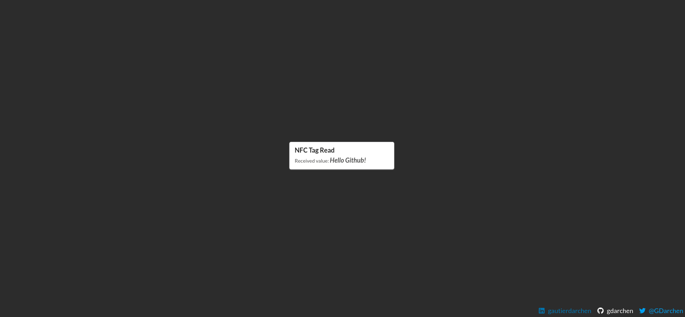

# Local server NFC Reader and _web-sockets_

This example aims at starting a local Node.js server handling the NFC reading task.

Whenever an NFC tag is read, a _web-socket_ is sent to a front-end application to communicate the payload.

---

## Set-up

### 1 - Launch the local server

First, navigate to the local server folder.

```bash
$ cd REPOSITORY_FOLDER/2-local-nfc-server/nfc-server
```

This project aims at starting a local server to interact with a USB NFC Reader and send read tags
via websockets.

It has been tested with this configuration:

- NFC Reader: ACR122U
- Tags: NTAG213

#### How it works

On `connection` events, the server starts listening for `require-scan` events.

It interacts with the NFC USB Reader and sends the detected payload thanks to a `nfc-tag-scanned` event to the socket.

#### Installation

To install the required dependencies, please run the following command:

```bash
# NPM
$ npm install
# Yarn alternative
$ yarn install
```

#### Start

To start the local server, please run the following command:

```bash
# NPM
$ npm start
# Yarn alternative
$ yarn start
```

### 2 - Run the client app

Navigate now to the client application folder.

```bash
$ cd REPOSITORY_FOLDER/2-local-nfc-server/client-app
```

This application is the client communicating via _web-sockets_ with the previously started local Node.js serving handling the NFC scanning behaviour.

#### How it works

When loading the application and the `<Home />` component, a `require-scan` event is sent to the _web-sockets_ server.

Afterwards, the server will answer by sending `nfc-tag-scanned` events to the client, with the read payload.

#### Installation

To install the required dependencies, please run the following command:

```bash
# NPM
$ npm install
# Yarn alternative
$ yarn install
```

#### Start

To run the client app locally, please run the following command:

```bash
# NPM
$ npm start
# Yarn alternative
$ yarn start
```

---

## Read tags

For this demo, I used NXP Mifare Ultralight NTAG213.

To simplify the payload decoding, I chose to encode the payload between **slashes** such as `/THIS IS MY PAYLOAD/`. Indeed, when reading from the buffer, it simplifies the way we decode the payload.

> You can also encode your own message using an external application such as [NFC-Tools](https://www.wakdev.com/apps/nfc-tools-pc-mac.html).

Whenever both the local server and the client application are running, and the NFC Reader is plugged (ACR122U in my example), a loader is displayed.


Afterwards, you can approach your previously written tag on the NFC reader so as to decode its content. If it is read successfully, the payload is sent via _web-sockets_ and a card is displayed.


