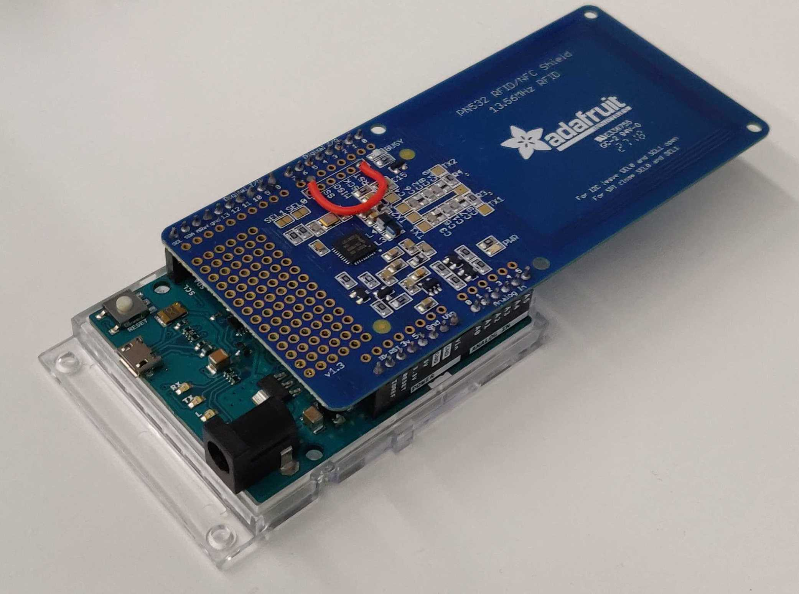
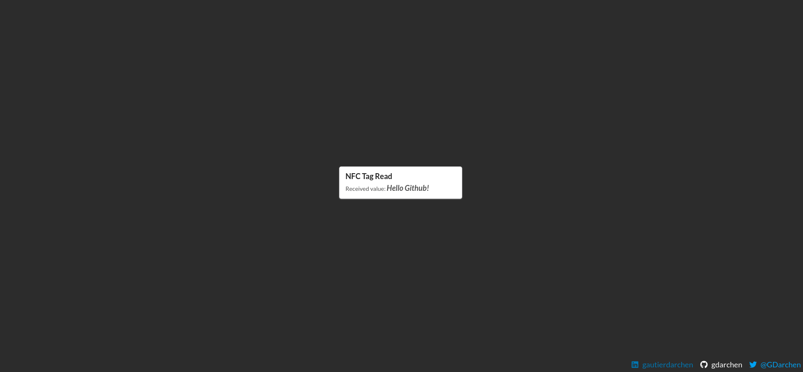

# Using _WebUSB_ and a Arduino board

This example aims at showing up how to communicate between a USB Arduino board plugged in a NFC card reader with a web applixation.

Whenever an NFC tag is read, the decoded payload is written by the Arduino in a WebUSB serial and the front-end application can read it.

---

## Set-up

### Micro controller

> As you can see [here](https://github.com/webusb/arduino#compatible-hardware), the following boards can be used to communicate with WebUSB:
> 
> * Arduino Leonardo
> * Arduino/Genuino Micro
> * Arduino/Genuino Zero
> * Arduino/Genuino MKR1000
> * Arduino MKRZero
> * Arduino MKR FOX 1200
> * Arduino MKR WAN 1300
> * Arduino MKR GSM 1400
> * Arduino MKR NB 1500
> * Arduino MKR WiFi 1010
> * Arduino MKR Vidor 4000
> * Arduino NANO 33 IoT
> * Adafruit Feather 32u4
> * Adafruit ItsyBitsy 32u4
> * Adafruit Feather M0 Express

I tested it using a **Arduino Leonardo** board.

### NFC Tag Reader shield

To read NFC tags, you have to buy a NFC Tag Reader shield.

I used a [Adafruit PN532 NFC/RFID Controller Shield for Arduino](https://www.adafruit.com/product/789) for this example.

You can find wiring instructions [here](https://learn.adafruit.com/adafruit-pn532-rfid-nfc/shield-wiring).

> **Warning:** if you use a Arduino Leonardo or Yum, there is special wiring feature. 
> 
> Indeed, [here](https://learn.adafruit.com/adafruit-pn532-rfid-nfc/shield-wiring#using-with-the-arduino-leonardo-and-yun-3-5) are mentioned the specific instructions:
> > The IRQ pin is tied to Digital pin #2 by default. However, on the Arduino Leonardo and Yun, digital #2 is used for I2C which will not work. If using with a Leonardo or Yun, cut the trace beween the IRQ pin and Digital #2 and solder a wire from IRQ pin to Digital #4 or higher. [...]
> 
> You then have to:
> 1. Cut with a sharp knife the trace from IRQ to ping #2
> 2. Solder a wire from IRQ to #6

Afterwards, you should have a device like the following:



### 1 - Configure the Arduino

#### Environment

First, we need to configure our system to be able to program the Arduino board. We need to:

* Configure the device to upgrade it from USB 2.0 to USB 2.1
* Install the required libraries (NFC Reading, WebUSB, etc.)

Follow the instructions below, which are based and adapted from the ones given [here](https://github.com/webusb/arduino#getting-started):

1. Install at least version 1.6.11 of the [Arduino IDE](https://www.arduino.cc/en/Main/Software).

2. The WebUSB library provides all the extra low-level USB code necessary for WebUSB support except for one thing: Your device must be upgraded from USB 2.0 to USB 2.1. To do this go into the SDK installation directory and open `hardware/arduino/avr/cores/arduino/USBCore.h`. Then find the line `#define USB_VERSION 0x200` and change `0x200` to `0x210`. That's it!
 
**macOS**: Right click on the Arduino application icon and then click on show package contents menu item. Navigate to `Contents/Java/hardware/arduino/avr/cores/arduino/USBCore.h`

**Warning**: Windows requires USB 2.1 devices to present a Binary Object Store (BOS) descriptor when they are enumerated. The code to support this is added by including the "WebUSB" library in your sketch. If you do not include this library after making this change to the SDK then Windows will no longer be able to recognize your device and you will not be able to upload new sketches to it.

3. Copy (or symlink) the `<REPOSITORY_FOLDER>/3-webusb/arduino/libraries/*` directories from this repository into the libraries folder in your sketchbooks directory.

4. Launch the Arduino IDE. You should see "WebUSB" as an option under "Sketch > Include Library".

#### Board programming

You are now ready to load the Arduino sketch on your board.

After having plugged the previously configured device, open your Arduino IDE, and select it from the plugged boards.

Import the sketch from this repository (`<<REPOSITORY_FOLDER>/3-webusb/arduino/sketches/NFCWebUsbReadTag/NFCWebUsbReadTag.ino`) and upload it to your board.

It should now be listening for NFC tags, you now have to configure the client application to interpret the read payloads.

### 2 - Run the client app

Navigate now to the client application folder.

```bash
$ cd <REPOSITORY_FOLDER>/3-webusb/client-app
```

This application is the client communicating using WebUSB with the previously configured Arduino board.

#### How it works

> Since WebUSB is an API, its implementation might be different according to your web browser. I designed it to work using Chrome.

All the logics is in the `useNFCReader` React hook. After having authorized the communication between the client application and the plugged device, we have to configure the communication interface.

Using WebUSB and its implementation, we request the device thanks to its `vendorId`.

Afterwards, we select the right configuration and interface. We then activate the channel we want to communicate through thanks to the `controlTransferOut` method.

Finally, we trigger a recursive `readLoop` method in which we try to read the payload from the device and decode it.

#### Installation

To install the required dependencies, please run the following command:

```bash
# NPM
$ npm install
# Yarn alternative
$ yarn install
```

#### Start

To run the client app locally, please run the following command:

```bash
# NPM
$ npm start
# Yarn alternative
$ yarn start
```

---

## Read tags

For this demo, I used NXP Mifare Ultralight NTAG213.

To simplify the payload decoding, I chose to encode the payload between **slashes** such as `/THIS IS MY PAYLOAD/`. Indeed, when reading from the buffer, it simplifies the way we decode the payload.

> You can also encode your own message using an external application such as [NFC-Tools](https://www.wakdev.com/apps/nfc-tools-pc-mac.html).

Whenever the client app is running and waiting for the device to read NFC Tags and send it through WebUSB, a loader is displayed.


Afterwards, you can approach your previously written tag on the Arduino NFC reader so as to decode its content. If it is read successfully, the payload is sent via WebUSB and a card is displayed.


